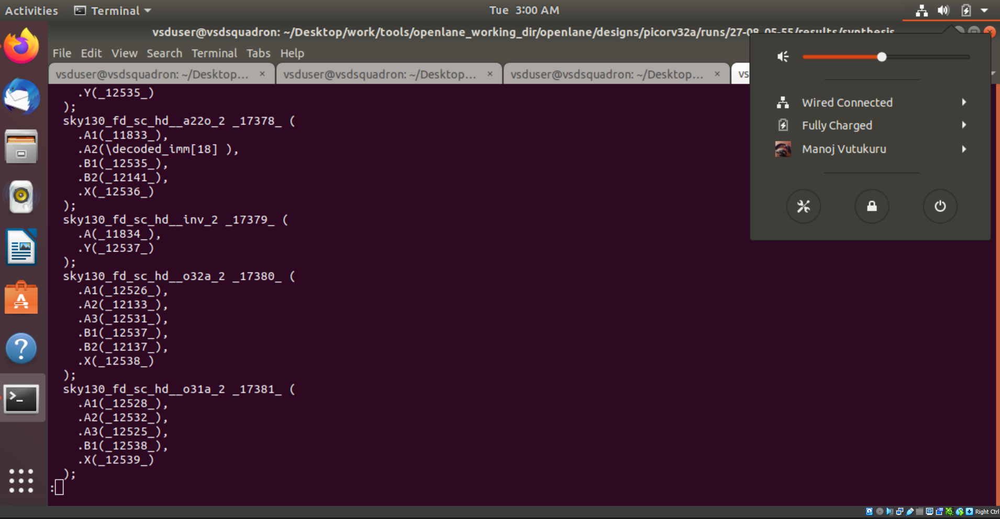
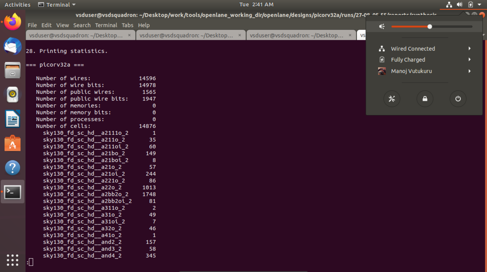
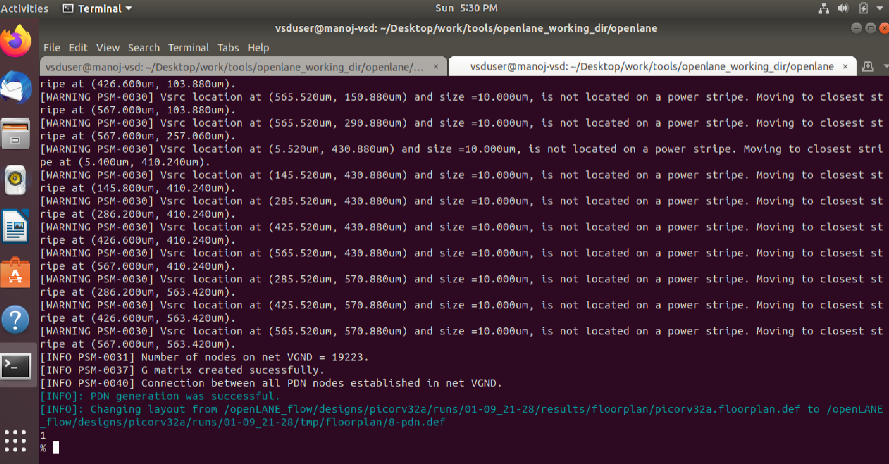
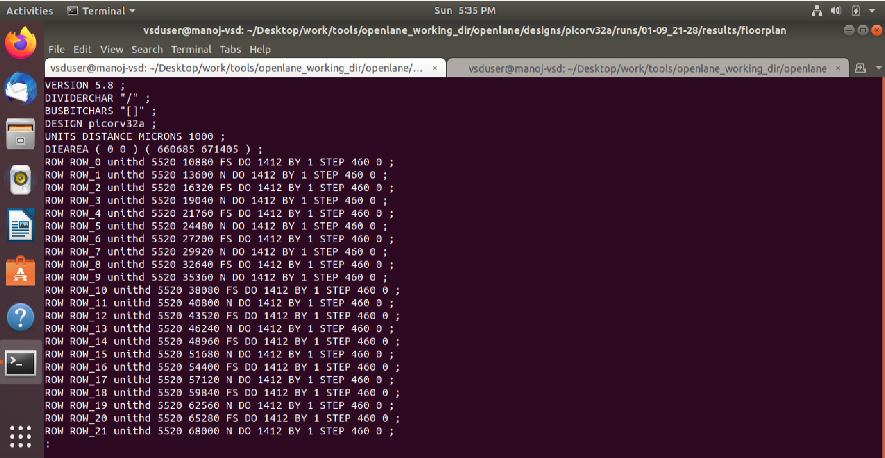
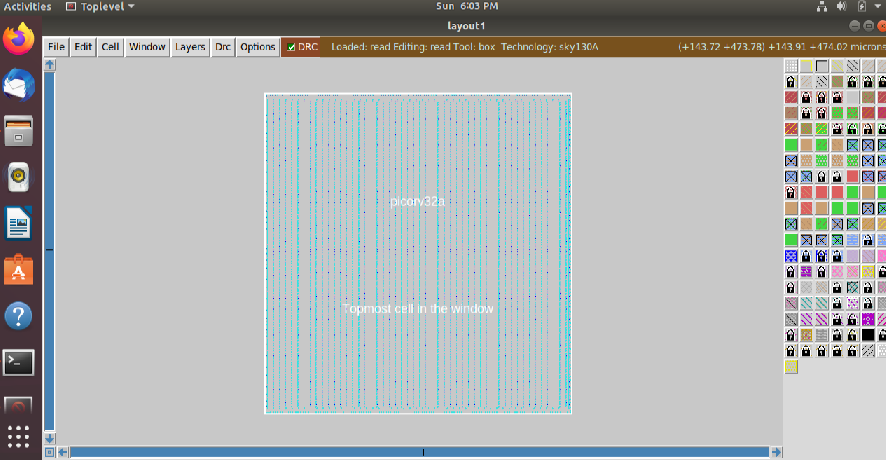
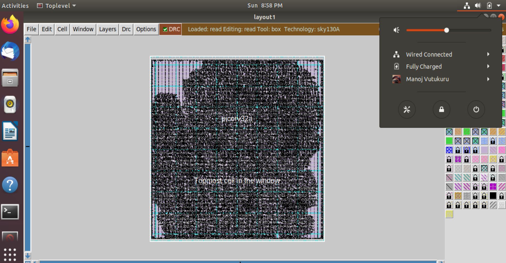

# NASSCOM-VSD-SoC-Design
This is a workshop offered by VLSI System Design, focused on RTL to GDSII flow of ICs using open-source tools and PDKs (Skywater 130).

# Day 1 Lab
Synthesis Steps:

```bash
./flow.tcl -interactive
package require openlane 0.9
prep -design picorv32a
run_synthesis
```
### Synthesis Successful using openLANE interactive


### Synthesized RTL


### Synthesis Reports

Flop Ratio = No. of cells / No. of D FFs
=> Flop Ratio = 14876/1613 = 9.2



# Day 2 Lab
Placement Steps:

```bash
./flow.tcl -interactive
package require openlane 0.9
prep -design picorv32a
run_floorplan
```
### Floorplan Successful using openLANE interactive



### Floorplan DEF File


### Floorplan Magic Output

Die Area = 660685 / 1000 , 671405 / 1000 => 660 x 671 microns



### Placement
Floorplan Steps:

```bash
./flow.tcl -interactive
package require openlane 0.9
prep -design picorv32a
run_placement
```
### Floorplan Magic Output

Die Area = 660685 / 1000 , 671405 / 1000 => 660 x 671 microns


