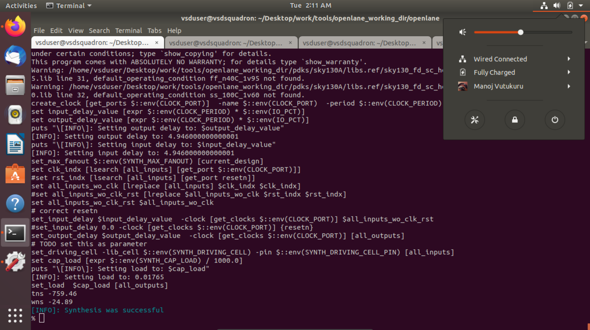

# NASSCOM-VSD-SoC-Design
This is a workshop offered by VLSI System Design, focused on RTL to GDSII flow of ICs using open-source tools and PDKs (Skywater 130).

# Day 1 Lab
Synthesis Steps:

```bash
./flow.tcl -interactive
package require openlane 0.9
prep -design picorv32a
run_synthesis
```
### Synthesis Successful using openLANE interactive



### Synthesized RTL


### Synthesis Reports

Flop Ratio = No. of cells / No. of D FFs
=> Flop Ratio = 14876/1613 = 9.2


# Day 2 Lab
Floorplan Steps:

```bash
./flow.tcl -interactive
package require openlane 0.9
prep -design picorv32a
run_floorplan
```
### Floorplan Successful using openLANE interactive


### Floorplan DEF File


### Floorplan Magic Output

Die Area = 660685 / 1000 , 671405 / 1000 => 660 x 671 microns


### Placement
Placement Steps:

```bash
./flow.tcl -interactive
package require openlane 0.9
prep -design picorv32a
run_placement
```
### Floorplan Magic Output


# Day 3 Lab

### Adding custom cell to the layout: 
Gitclone the inverter cell and open it using magic.


### Extract the spice file for simulation:
```bash
extract all 
ext2spice cthresh 0 rthresh 0
ext2spice
```


Give inputs to the spice file and set the analysis type (tran):


### Inverter Simulation:


### Calculate the rise time, fall time and propagation delay
Rise Time = 2.23 ns - 2.17 ns = 0.06 ns <br>
Fall Time = 4.08 ns - 4.04 ns = 0.04 ns <br>
Propagation Delay = 2.207 ns - 2.148 ns = 0.005 ns 

### DRC check exercise

1. Download the lab files from opencircuitdesign webiste. <br>
2. Open poly.mag file and verify if DRC errors are properly displayed. <br>
3. Edit the sky130A.tech file and update the tech file to see the added DRC checks. <br>


